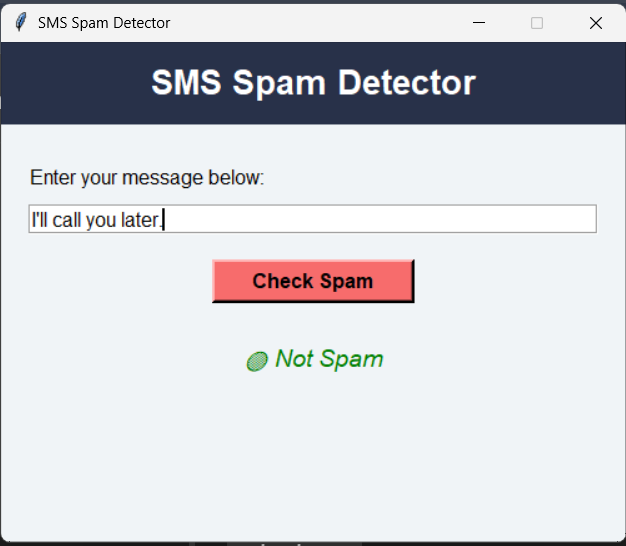
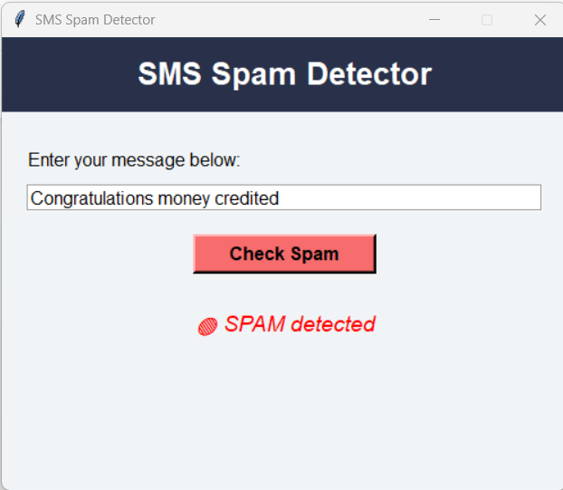

# SMS-Spam-Detection

# SMS Spam Detection

This project is a machine learning-based SMS Spam Detection system that classifies text messages as either **Spam** or **Ham (Not Spam)** using a trained model.

## 📌 Project Overview

SMS spam is one of the most common problems faced by mobile users. This project uses a Natural Language Processing (NLP) pipeline with a classification model to automatically detect and filter out spam messages.

## 📂 Project Structure

- `SMS Spam Detection.ipynb` - Jupyter Notebook containing the full pipeline (data cleaning, feature extraction, training, evaluation).
- `spam.csv` - Dataset of labeled SMS messages.
- `spam_detector.pkl` - Trained model file.
- `tfidf_vectorizer.pkl` - TF-IDF vectorizer used for feature extraction.

## 🧠 Technologies Used

- Python
- Scikit-learn
- Pandas, NumPy
- Natural Language Processing (TF-IDF)
- Jupyter Notebook

## 📊 Dataset Info

The dataset (`spam.csv`) contains a collection of SMS messages labeled as "ham" (legitimate) or "spam".

| Label | Message Example                     |
|-------|-------------------------------------|
| ham   | "I'll call you later."              |
| spam  | "Congratulations! You've won $1000!"|

## 🔧 How It Works

1. **Text Preprocessing** - Cleaning, tokenization, and vectorization.
2. **Model Training** - Using a machine learning classifier (e.g., Naive Bayes).
3. **Prediction** - Classify new messages as spam or ham.

## 🖼️ Output Example

Here is a sample output of the SMS Spam Detection system:

## 🚀 Getting Started

1. Clone the repository or download the files.
2. Open `SMS Spam Detection.ipynb` in Jupyter Notebook.
3. Run the cells to train or test the model.
4. Use `spam_detector.pkl` and `tfidf_vectorizer.pkl` in a Python script or web app for real-time predictions.

## 📈 Future Enhancements

- Deploy the model with a Flask or Django web app.
- Build a mobile or web interface.
- Improve performance using deep learning.

## 📄 License

This project is for educational purposes only.
